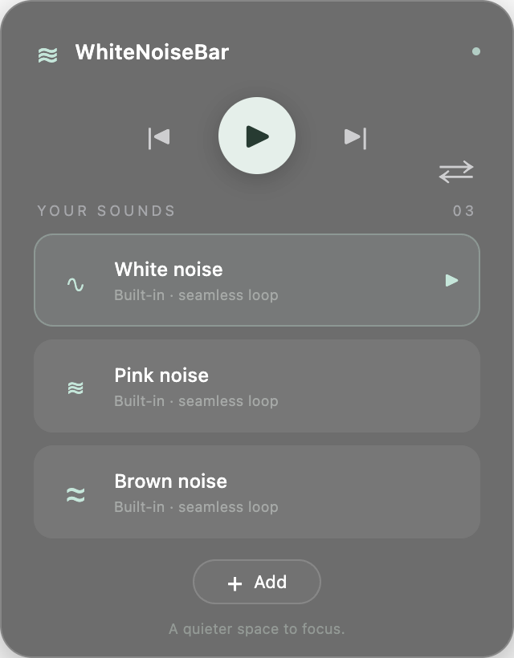

# WhiteNoiseBar

WhiteNoiseBar is a small macOS menu bar player for continuous background sound. It comes with white, pink, and brown noise and can import audio from a YouTube link. Built with Electron, HTML, CSS, and JavaScript; Xcode is not required.



## What it does

- Plays and loops local audio while the panel is hidden.
- Clicks on a sound to play it; clicking the selected sound pauses or resumes at the same position.
- Shows a seek timeline along the bottom of the selected sound when you hover over it. Drag to change position.
- Provides previous, next, and shuffle controls. Shuffle changes manual track navigation while the current sound continues to loop.
- Imports YouTube audio through `yt-dlp` and FFmpeg, with download status inside the panel.
- Offers **Rename sound** and **Delete sound** when you right-click a sound. The name is edited inside its tile; press Enter or Save to keep it, or Escape to cancel. Imported files are moved to the Mac Trash when deleted.
- Remembers the selected sound, playback position, playing state, shuffle state, and saved library between launches.

## Install and run

Requirements: an Apple Silicon Mac, Node.js, Homebrew, `yt-dlp`, and FFmpeg. The app currently uses Homebrew tools from `/opt/homebrew/bin`.

```sh
brew install yt-dlp ffmpeg
npm ci
npm start
```

Click the waveform icon in the menu bar to show or hide the player. Right-click the menu bar icon to quit. The panel hides when it loses focus; playback continues.

To create a `.app` bundle:

```sh
npm run package
```

The bundle is created at `dist/WhiteNoiseBar-darwin-arm64/WhiteNoiseBar.app`. Copy it into `/Applications` to install it. The bundle uses a local ad-hoc signature and has not been notarized for distribution to other Macs. The packaged UI includes its own Electron runtime; importing links still uses the Homebrew tools listed above.

## Where audio is stored

YouTube imports go to `~/Library/Application Support/WhiteNoiseBar/audio/`. Track details are saved in `~/Library/Application Support/WhiteNoiseBar/tracks.json`. Built-in noise files are bundled in `assets/`. Download only audio that you have permission to save. Some YouTube videos may be unavailable or require authentication.

## Project files

- `main.js` manages the menu bar icon, player window, library, downloader, and local audio protocol.
- `preload.js` exposes a limited bridge to the player.
- `index.html`, `styles.css`, and `renderer.js` implement the interface and playback controls.
- `assets/` contains the built-in sounds and icons.
- `build.cjs` packages the Mac app.

Run `npm run check` to check JavaScript syntax. The player window uses Electron context isolation and sandboxing, and downloader arguments are passed without a shell.
